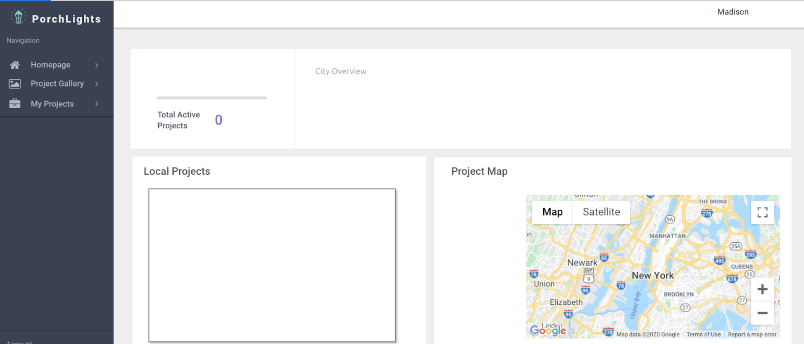
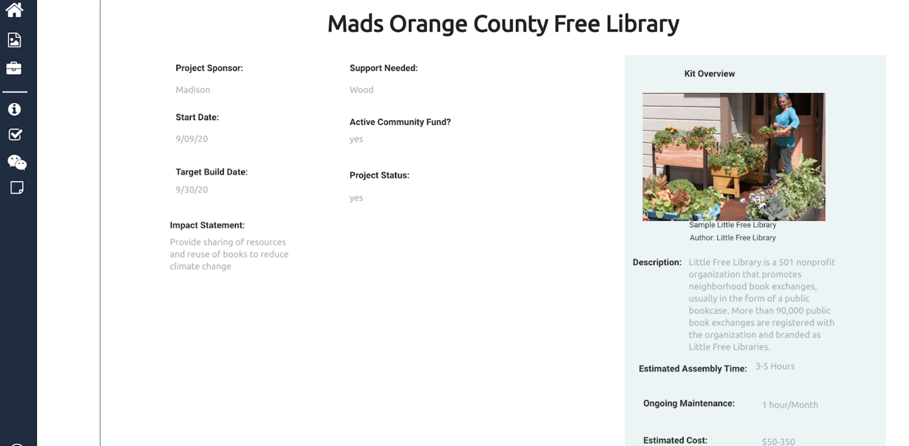
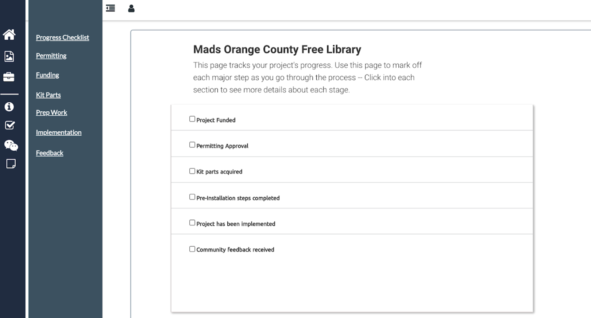
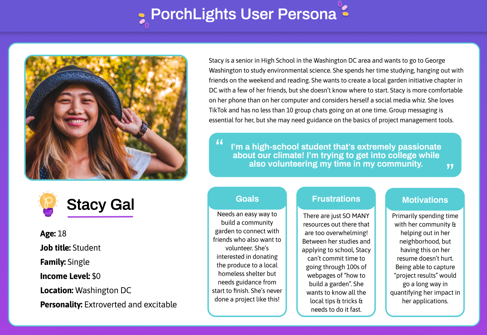
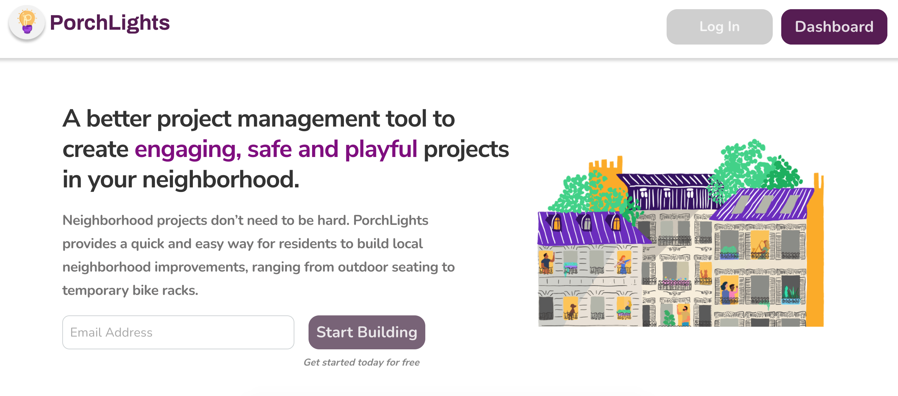
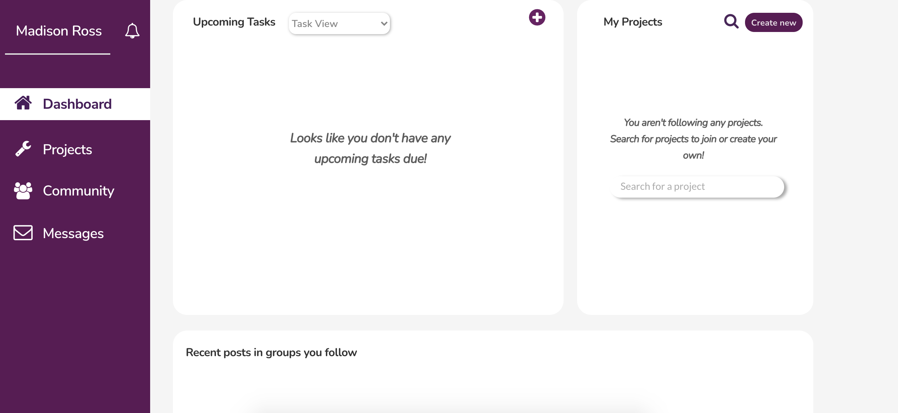
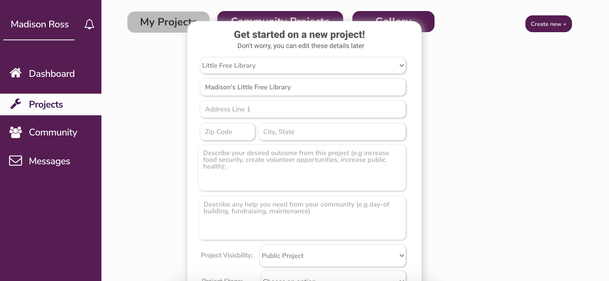
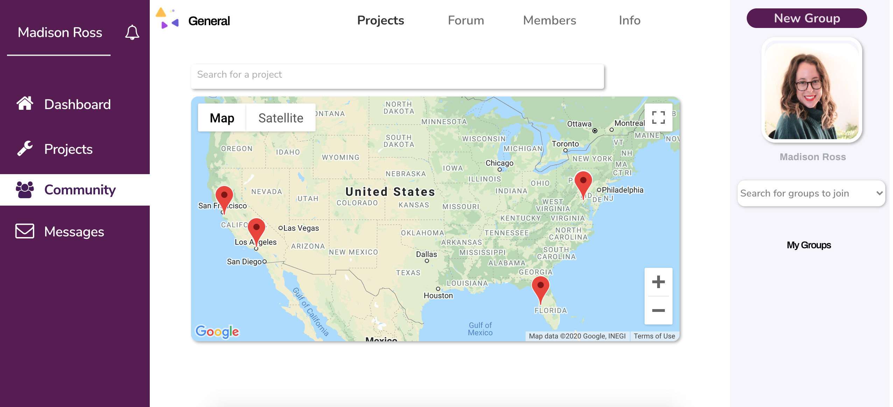

# Redesigning PorchLights UX/UI

## Problem Statement

City building, urban innovations, and funding tend to come from government agencies and private developers over long time periods. The tactical urbanism movement has brought attention to the need and ability for residents to reclaim public space in order to solve local challenges.

How might we create a one-stop-shop for community members to collaborate and work towards the common good? How might we make this process an enjoyful and empowering experience, of what would otherwise require sifting through outdated and poorly laid out government websites? That's where PorchLights comes in.

PorchLights' platform enables planners, organizers, residents and local business owners to enhance their neighborhoods using urban project kits. Bundled project kits have included parklets, porch concerts, community gardens, bike hubs, and others, including options to design custom kits that solve specific challenges.

## The Original Design of PorchLights (V0)

Let's start with ground 0 of PorchLights, the minimum viable product developed by the CEO/Founder during PorchLights infancy. Here are my observations at this stage:

- The original design has minimal color and personality.
- The navigation bars and icons are cluttered and not very intuitive. I had trouble navigating through the interface and found myself deep in a second navigation bar. I want to refocus the navigation and page content based on the user's needs.
- The information architecture is not very intuitive (from headers to content). For example, the Home page shows projects in the community, instead of information on their own project. 

### Design Goals for PorchLights

The product goals of PorchLights are to better understand their target users, create a scalable solution with a seamless and welcome user experience, and further develop functionality based on feedback from its user base.

As the first designer and Head of User Experience for PorchLights, I worked directly with the CEO and Founder to build user personas, structure the web application's information architecture, and design over 15 user interfaces, a branding guide, and custom illustrations in Figma for a whimsical and sleek end-to-end user experience.

## Start With the User - Building User Personas

PorchLights works directly with their primary users and stakeholders to understand their needs, from which we identified the following barriers preventing residents from improving the public realm: access to funding, design and hardware procurement, navigation of the legal and regulatory environment, and long-term ownership solutions.

Based on Porchlights' discovery interviews, we crafted two personas. George and Stacy represent the target market for PorchLights and they are who I referenced for guidance and direction when coming up with design solutions.

George is a restaurant owner who wants to be able to adapt his store to meet COVID-19 guidance, but has little knowledge of the permitting required. Government websites don't make it easy for him to find this knowledge. He also manages his project team and would like a streamlined way to communicate with his team rather than text message.

Stacy is a high-school student looking to take a more active role in her community by starting a garden project, but she has limited resources and wants to do it as quickly as possible. She wants a one-stop-shop for her project needs and guidance on fundraising and capturing feedback from her community to showcase her impact for college applications. She also wants to be able to learn from those in her community starting similar successful initiatives.

## Rethinking the Information Architecture

My goal with the information architecture was to minimize the clutter and focus on the user's goals to design appropriate functionality. We identified common challenges included managing project funding, complying with regulatory obligations, project implementation and ongoing maintenance, interacting with the community, and collaborating with a project team. We also reimagined the Home page to be a Dashboard providing an overview of project status and upcoming events.

There is a lot of information to detail within each project (i.e. project checklist, funding, implementation, etc.), but instead of spreading out across multiple pages I wanted to make it cohesive and easy to navigate by providing one main page with tabs for each section of the project.

Additionally, the navigation bar previously included a Project Gallery page, listing all available project kits. Based on user persona needs, George and Stacy probably won't visit this page once they've created their project. Therefore, this page and anything relating to a project was put under the "Projects" section.

Look through my linked [Information Architecture Table](https://www.notion.so/4e7712e9f17743b29b01a8e30e3c7d9f?v=d709c87d82c64e2fad5a167d544b0b4f) to see the changes made to the information architecture. I created a modern button-based (pop-up overlay) approach in the new architecture so that it can hold a lot of information while appearing on a seamless, main screen.

## Redesigning PorchLights

As the current process for community residents involved self-research and navigating through outdated and poorly laid out government portals, we wanted the experience for PorchLights to be fun and painless → whimsical and clean design.

I began sketching in order to visualize our ideas in low fidelity wireframes and then adapted the initial designs in Figma.

I also created a branding guide with custom illustrations and logo redesign to ensure future designers can build off my work.

The final designs are in [Figma](https://www.figma.com/file/ef6Jpo1bXkXLy5yFYp9tgm/PorchLights-Redesign?node-id=0%3A1) and my shots are available [my Dribbble Portfolio](https://dribbble.com/bymadisonross).

## Design Impact

At this stage, some of my ideas have been adapted into the application and have made a significant impact. The experience feels much more streamlined as I navigate through the project pages. My designs resulted in eight cities piloting PorchLights urban garden kit.

// number of users or other usage metrics

### Feedback from the PorchLights CEO

"Madison was instrumental in building the PorchLights user experience for our institutional partners and daily users. She spearheaded the user experience and design, crafted a seamless layout in Figma, and worked with us to develop user personas to better understand our user needs. Her designs supported the next iteration of features that led to greater daily user traffic and will continue to guide the vision of the platform! I could not recommend working with Madison enough to meet your design & user experience needs." 

- Rachel Halfaker, CEO and Founder of [PorchLights](https://app.porchlights.org/)

// feedback from users

## Summary

In summary, the development of user personas allowed PorchLights to better understand their target users and design a user experience that aligned with their goals. My redesign of the information architecture and user interface allowed the CEO/Founder to create a scalable solution with a seamless and welcoming user experience. Throughout this process we worked with users to evaluate additional functionality requirements (i.e. "Dashboard" and "Messages" pages) and incorporate it into the design.

As PorchLights grows its user base and expands its project kit offerings, we would like to further develop the "Community" page. By working with users of PorchLights we would like to better understand how they might collaborate on PorchLights and how we can design an experience/functionality that will meet their needs.